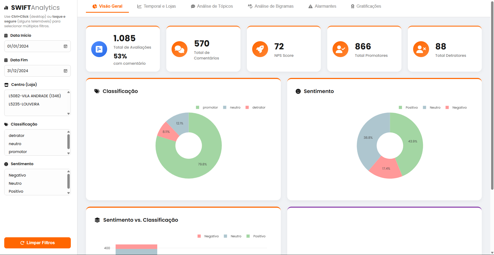

# 🚀 SwiftNPS: Análise de Sentimentos e Tópicos (NPS)

Este notebook automatiza a análise de comentários de NPS, transformando feedbacks qualitativos em dados estruturados usando modelos de IA com **80% de acurácia** na classificação de sentimentos.

### 👨‍💻 Criadores

| Eduardo | Fujita |
| :---: | :---: |
|  |  |

### 🧠 Modelos de IA Utilizados

* **Sentimento:** `pysentimiento/bertweet-pt-sentiment`
    * **Descrição:** Um modelo BERT (Bertweet) focado em português brasileiro, otimizado para classificar a polaridade (positiva, negativa, neutra) de textos curtos.
* **Tópicos (Zero-Shot):** `joeddav/xlm-roberta-large-xnli`
    * **Descrição:** Um modelo RoBERTa multi-idioma (XLM-R) que classifica textos em tópicos customizados (ex: "Preço", "Entrega"), mesmo sem ter sido treinado especificamente neles.

---

---

## ✨ Principais Funcionalidades

* **📈 Classificação de Sentimento:** Classifica automaticamente cada comentário como Positivo, Neutro ou Negativo.
* **🏷️ Modelagem de Tópicos:** Identifica e rotula o assunto principal de cada feedback (ex: Preço, Entrega, Atendimento, Produto, etc.).
* **🔎 Análise de Termos (TF-IDF):** Extrai e ranqueia a importância de bigramas (termos com duas palavras) para identificar os pontos mais críticos.
* **🗂️ Exportação Automática:** Salva todos os resultados em arquivos `.csv` e gera gráficos `.png` para análise posterior.

## 📊 Dashboard Interativo

Os dados processados por este script alimentam um dashboard interativo, que permite filtrar e visualizar os insights de forma dinâmica.

Acesse a visualização web do projeto em:
**[https://swiftnps.vercel.app](https://swiftnps.vercel.app)**

## 🛠️ Tecnologias Utilizadas

* **Google Colab** (Ambiente de execução)
* **Python**
* **Pandas** (Manipulação de dados)
* **Spacy** (Pré-processamento e lematização)
* **Scikit-learn (TfidfVectorizer)** (Análise de frequência de termos)
* **Transformers (Hugging Face)** (Modelos de IA para classificação)
* **Plotly** (Geração de gráficos)

## 📋 Pré-requisitos

* Uma conta Google.
* O notebook deve ser executado no ambiente **Google Colab**.
* O arquivo de dados (Excel) com os comentários de NPS.

## ⚙️ Como Usar (Passo a Passo)

Siga estas etapas na ordem correta para garantir que o script funcione.

### 1. Configuração do Ambiente

* **GPU:** Para uma análise mais rápida (especialmente da IA), ative o acelerador de GPU:
    * `Ambiente de Execução` -> `Alterar tipo de ambiente de execução` -> `T4 GPU`.
* **Instalação (Células 2 e 3):**
    * Rode as células que instalam as bibliotecas (`!python -m spacy download...` e `!pip install pandas...`).

### 2. Upload do Banco de Dados (Obrigatório)

Esta é a etapa mais importante. O script procura por um nome de arquivo específico.

* **Nome do Arquivo Esperado:** `NPS-Comentarios-2024-Louveira_VilaAndra.xlsx`

**Como fazer o upload:**

1.  No Google Colab, abra a barra lateral esquerda e clique no ícone de **Pasta** (Arquivos).
2.  Arraste o seu arquivo `.xlsx` do seu computador e solte diretamente nessa área.
3.  Aguarde o upload ser concluído.

> **Atenção:** Se o seu arquivo tiver um nome diferente, você **deve** renomeá-lo para o nome esperado **ou** alterar o nome do arquivo na Célula 4 do script:
>
> `df = pd.read_excel('SEU_NOME_DE_ARQUIVO_AQUI.xlsx')`

### 3. Execução Principal (Célula 4)

* Rode a célula longa que começa com `# --- 1. Imports Gerais ---`.
* Esta é a célula principal que faz todo o trabalho: carrega o Excel, limpa os dados, executa a IA, faz a análise TF-IDF e salva os resultados.
* **Este processo pode demorar vários minutos**, especialmente na primeira vez.

*(As células 5 e 6 são opcionais para exportação ao Google Sheets).*

## 📤 Resultados (Outputs)

Ao final da execução, você encontrará os seguintes arquivos no painel "Arquivos" do Colab (clique com o botão direito para baixar):

* **Arquivos CSV (Dados Processados):**
    * `NPS_Classificacao_Completa.csv`: O banco de dados original + colunas de sentimento e tópico.
    * `NPS_TFIDF_Bigramas_COM_FREQ.csv`: Análise de bigramas por classificação (detrator, neutro, promotor).
    * `NPS_TFIDF_Bigramas_POR_TOPICO_SENTIMENTO.csv`: Análise de bigramas por tópico e sentimento.

* **Gráficos (Imagens):**
    * Uma nova pasta `graficos_tfidf_centro` será criada contendo os gráficos de bigramas salvos como `.png`.
